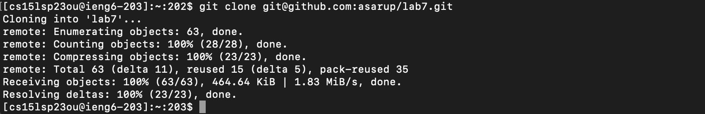
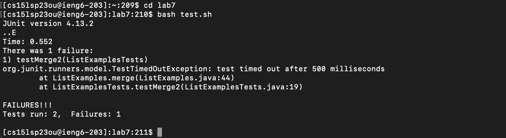
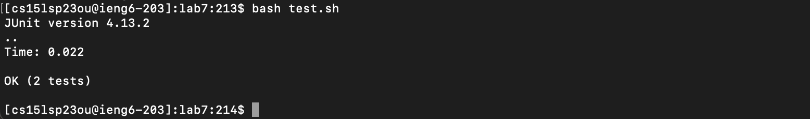
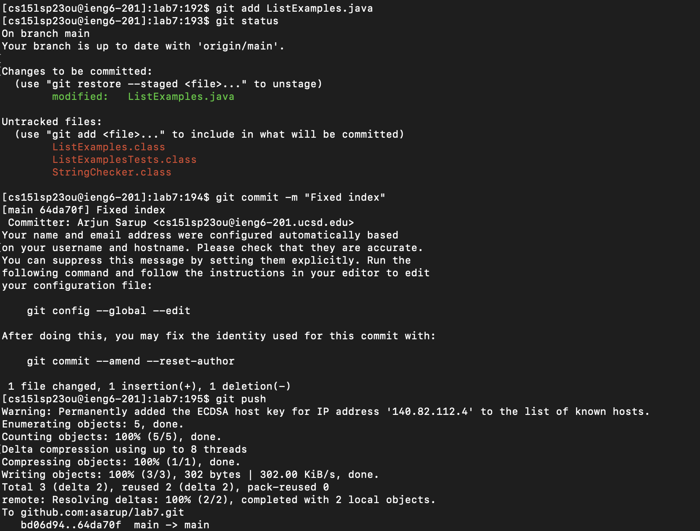

# Lab Report 4
Name: Arjun Sarup

PID: A17527244

Email: asarup@ucsd.edu

---

## Quick Editing From the Command Line

This week's lab was all about using `vim` to edit files from a `git` repository that was cloned on a remote server. The task at hand was to:

1. Log into ieng6
2. Clone your fork of the repository from your Github account
3. Run the tests, demonstrating that they fail
4. Edit the code file to fix the failing test
5. Run the tests, demonstrating that they now succeed
6. Commit and push the resulting change to your Github account (you can pick any commit message!)

I was able to accomplish these tasks in just under 2 minutes, thanks to some quick shortcuts in the command line and `vim`.

## Step 1

*Keys/Commands used: `<up><up><enter>`*

This step was pretty straightforward. To log into `ieng6`, since it was in my command history, all I had to do was use the up arrow key to bring the command up and press enter to execute it.

## Step 2

*Keys/Commands used: `git clone <Ctrl+v><enter>`*

For this step, I first copied my GitHub repository's `ssh` link (git@github.com:asarup/lab7.git) to my laptop's clipboard, then switched to my terminal and typed `git clone ` and pasted the URL. This cloned my remote repository to my folder on the `ieng6` machine. 

## Step 3

*Keys/Commands used: `cd lab7<enter>`, `bash t<tab><enter>`*

This next step, I first had to navigate into the newly cloned `git` repository on `ieng6`, so I used the `cd` command. Then, I needed to run the commands defined in `test.sh` to show that the program was failing, so I started typing `bash t` and then used `<tab>` to autocomplete the file name to `test.sh`. The tests ran and failed, as can be seen in the screenshot.

## Step 4

*Keys/Commands used: `vim L<tab>.<tab><enter>`, (now in `vim`): `[/index1][<enter>][9n][e][x][i][2][<esc>][:wq]`*

There's a lot going on in this step. First, I enter `vim` by using the command `vim <file>`, where instead of `<file>` I type `L<tab>`, which autocompletes to `ListExamples`, then type `.<tab>`, which autocompletes the rest of the file name to `ListExamples.java`. After doing all that, I can finally start editing the `ListExamples.java` file in `vim`. The first thing I do is find the line I need to change by using `/index`, which is a command in `vim` that searches the file for the keyword that follows the slash. This brings me to the first occurrence of the keyword, where I press `<enter>` to go back into normal mode. Then I press `9n`, which skips ahead to the next occurrence of the current word 9 times. This brings me to the occurrence of `index1` in the file that needs to be changed. Then I press `e` to move my cursor to the end of the word, so that it hovers above the `1`. From there I press `x`, which deletes the current character (leaving me with just `index`), followed by `i` to go into insert mode, then `2` so that the line now reads `index2` instead of `index1`. Finally, I save and exit using `:wq`, bringing me back to the `ieng6` terminal.

## Step 5

*Keys/Commands used: `<up><up><enter>`*

Since I just ran the tests a couple commands earlier using `bash test.sh`, all I needed to do was press the up arrow twice to bring up that same command, and hit enter to run the tests. And it seems like I edited the files properly in the last step, since now all the test cases defined in `ListExamplesTests.java` seem to pass. With that done, we can move on to pushing the changes to the remote repository.

## Step 6

*Keys/Commands used: `git add L<tab>.java<enter>`, `git status<enter>`, `git commit -m "Fixed index<enter>`, `git push<enter>`*

To push to the repo, the first step was to add the changes I made to `ListExamples.java` to the set commits that will be pushed. This is done using `git add <file>`, for which I used bash's autocomplete to type `git add ListExamples.java`. After that, I quickly confirmed that those and only those changes were being committed using `git status`. Once I did that, I committed the changes with `git commit` and added the message `"Fixed index"` to accompany my commit. Finally, I pushed the changes to the remote repository using `git push`.

---

And that's that! It seems like a lot, but with a little practice, it can be done surprisingly quickly and easily with the right command-line shortcuts.

